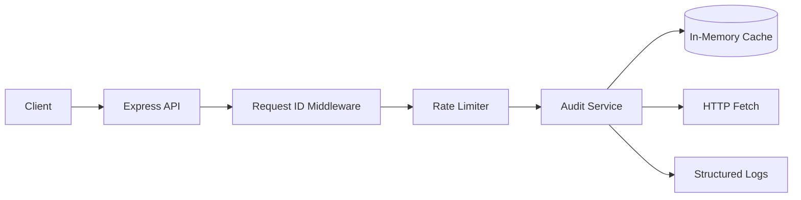

# Page Pulse Architecture

## Overview

Page Pulse is a production-oriented URL audit service that accepts audit requests, validates input, applies caching, and returns structured results.

## Components

- API layer: Express HTTP server
- Middleware: request ID, rate limiting, error handling
- Audit service: orchestrates validation, concurrency control, and caching
- Cache: in-memory map keyed by URL with TTL
- Observability: structured JSON logs with request IDs

## Data flow

1. Client sends a request to POST /api/audit.
2. Request ID middleware attaches a correlation ID and logs the request.
3. Rate limiter checks the client’s request budget.
4. Audit service validates the URL and checks the in-memory cache.
5. If uncached, the service performs the fetch with a timeout and concurrency guard.
6. Result is returned as a structured JSON response and optionally cached.

## Diagram

## Scaling strategy

- Keep the service stateless and horizontally scalable.
- Use a shared cache layer such as Redis when scaling beyond a single instance.
- Introduce a queue for background audits when throughput grows beyond the synchronous limit.
- Use a reverse proxy and load balancer in front of multiple instances.
